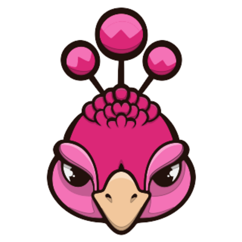
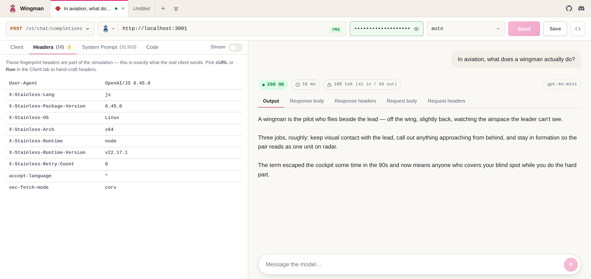

<br />


### Wingman - the Postman for LLMs.

[](https://github.com/mnfst/wingman/actions/workflows/ci.yml)
[](LICENSE)
[](https://github.com/mnfst/wingman/pulse)
[](https://www.solidjs.com)
[](https://discord.gg/FepAked3W7)
[](https://wingman.manifest.build)

Wingman is an API client for LLMs. Pick a wire format (OpenAI Chat Completions, OpenAI Responses, Anthropic Messages), paste a base URL and a key, and call anything that speaks it: OpenAI, Anthropic, Groq, Together, DeepSeek, your own gateway.

Configure the request like Postman, read the reply like ChatGPT, then flip a tab to see the exact bytes that went over the wire. It can also impersonate the clients a proxy sees in the wild (OpenClaw, Hermes, the OpenAI SDK, LangChain) by replaying their real headers and system prompts.

No backend. Requests go from your tab straight to the endpoint you typed, so nothing is proxied and nothing is logged. Nothing is kept either: your key, base URL, history and prompts all sit in `sessionStorage` and die with the tab.

Open it at **[wingman.manifest.build](https://wingman.manifest.build)**, or run it locally if your gateway is on localhost. It installs as an app too. Hit Install in the status bar, or use your browser's install button, and you get a window of its own and a cold start that doesn't wait on the network. Pointing it at a gateway, CORS rules, and why localhost is a problem of its own: [docs/connecting.md](docs/connecting.md).

Built by the team behind [Manifest](https://manifest.build).



## Contributing

```bash
git clone https://github.com/mnfst/wingman && cd wingman
npm install
npm run dev     # http://localhost:3002
```

Issues and pull requests are welcome. [CONTRIBUTING.md](CONTRIBUTING.md) covers the rest, and it is short.

## License

MIT. See [LICENSE](LICENSE).
